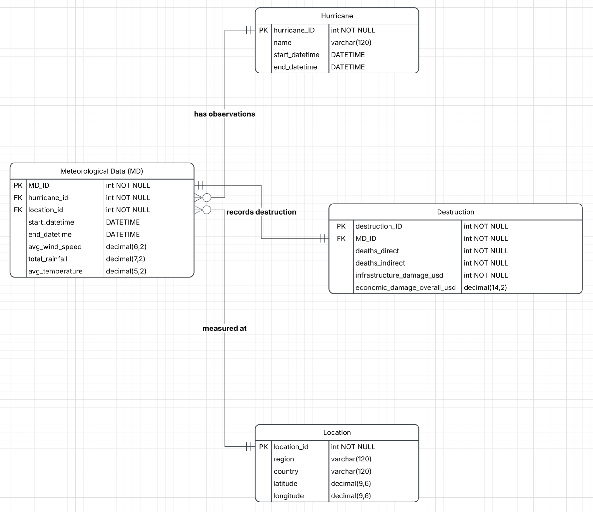
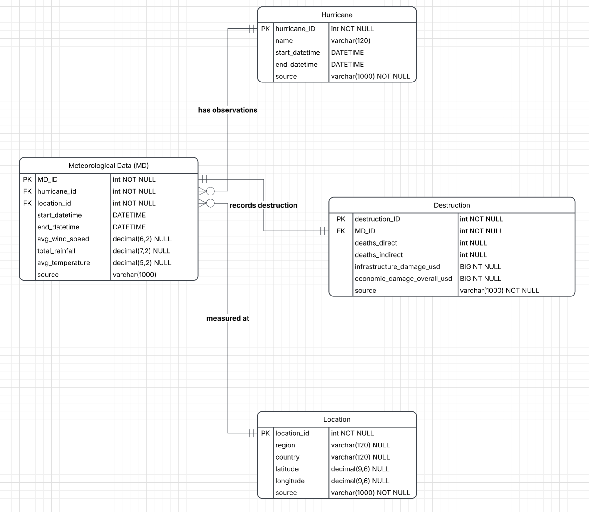

# Databases-Group17-hurricanesDB
A Databases course assignment by Group 17 

# Guide
All the necessary code to query through our mySQL server is inside hurricane_database.ipynb
All necessary background infromation is inside this README.md
Comments are added to understand the different code cells

# Overall topic of the DB
The main question we wanted to answer: Have hurricanes have become more destructive since climate change started? To answer this, we wanted to create a Database that contains all informaion about a hurricane. Specifcally, we wanted to know its full course, meereological data and the destruction it has caused along the way. By gathering all this information, we can later answer, the main question.

# Why this topic?
The topic we chose was to look at the overall broad societal issue: climate change. However, we felt climate change was a little too broad of a topic and decided to narrow it down. We therefore looked for a recent, clearly climate change linked disaster to narrow down our focus. This led us to Hurricane Melissa in 2025 and the severe destruction it caused across the Caribbean. So, we narrowed our focus down to hurricanes in general and decided to specifically look at the destruction hurricanes over time, and how climate change relates to hurricanes.

# Stakeholder

- **Residents and communities in hurricane-prone regions** (e.g. the Caribbean): directly affected by hurricanes; understanding their impact helps with prevention and minimizing destruction.
- **Businesses offering hurricane-preparedness products and services**: help people make their homes and properties ready for climate disasters, understand more detailledly how hurricanes happen.
- **Governments and emergency response agencies**: coordinate disaster response and long-term resilience planning, and need to act quickly when a hurricane hits. They could understand how destructive hurricanes are becoming.
- **Insurance companies**: bear the financial risk of hurricane destruction. It would help them restructure their contracts, when it maybe comes out that hurricanes might get more destructive than before climate change.
- **The general public**: the aftermath of a hurricane shows the real and ongoing effects of climate change, which makes the issue relevant to everyone.

# Idea of our ERD
The idea of the ERD is to build a database in which many different hurricanes from all over the years can be stored and compared based on the destruction they caused in different locations and time periods. We want to use this database to later assess if hurricanes and hurricane destruction have intensified over time. We do know that data may not be available in the amounts we would need to prove this, yet we still chose this idea, because it could help answer this question. Where full time-series data is not available we will have to restrict comparisons to the subset of hurricanes which do have sufficient amounts of data. We want to see if the storm’s intensity is somehow related to climate change and this motivated our decision to examine the broader pattern of hurricane destruction over time.

# Our initial ERD

# Explanation of our intial ERD

We basically have four main entities: Meteorological Data (MD), Hurricane, Destruction and Location. Each of the four entities do have an attribute to give each record their unique identity. Hurricane entity stores the basic data on the entity such as the start and end time and its name. The Meteorological Data (MD) entity represents a specific time window during which a specific hurricane was present at a specific location, along with the weather conditions recorded during that window.
One hurricane can pass through a location multiple times and a single location can be affected by multiple hurricanes over the years. This creates a many-to-many relationship.
The Meteorological Data entity resolves this relationship by recording links to exactly one hurricane and exactly one location, while a hurricane or location can be linked to multiple MD records.
Location entity stores each affected place independently of any hurricane and the destruction entity captures the outcome caused by the conditions recorded in a specific MD window. Destruction connects MD instead of directly connecting to the location and hurricane, because we think that destruction should be modelled as a consequence of a specific meteorological event at a specific place and time rather than an independent fact about the hurricane or location alone.

# Relational Schema and constraints of our intial ERD

PK are in [] and FK are given a start (*)

Meteorological_Data([MD_ID]:int NOT NULL, hurricane_ID*:int NOT NULL, location_ID*:int NOT NULL, start_datetime:DATETIME, end_datetime:DATETIME, avg_wind_speed:decimal(6,2), total_rainfall:decimal(7,2), avg_temperature:decimal(5,2))

Hurricane([hurricane_ID]:int NOT NULL, name:varchar(120), start_datetime:DATETIME, end_datetime:DATETIME)

Destruction([destruction_ID]:int NOT NULL, MD_ID*:int NOT NULL, deaths_direct:int NOT NULL, deaths_indirect:int NOT NULL, infrastructure_damage_usd:int NOT NULL, economic_damage_overall_usd:int NOT NULL)

Location([location_ID]:int NOT NULL, region:varchar(120), country:varchar(120), latitude:decimal(9,6), longitude:decimal(9,6))

# Pitch video

[Watch our pitch video](./video/pitch.mp4)

# Integrating real data into our Database

In week 5, our task was to find real data and integrate it with the curretn structure of DB. For our DB, we decided to insert to different hurricanes and their MD date, destruction data and location data.

## Sources of our data

Hurricane Melissa: [MELISSA](https://www.nhc.noaa.gov/data/tcr/AL132025_Melissa.pdf)
Hurricane Ian: [IAN](https://www.nhc.noaa.gov/data/tcr/AL092022_Ian.pdf)
Hurricane Fiona: [FIONA](https://www.nhc.noaa.gov/data/tcr/AL072022_Fiona.pdf)
Other specific sources for specific values are inside the dataset.

## Explanation of data creation and cleaning

DO THIS MORE DETAILLED

We created an Excel sheet which contains all data for all of the four entites for differnet hurricnaes. We currently have 2. The main struggles we faced, was that we found detailled infromation of Metereological Data and Location Data for the hurricanes. But finding high quality destruction data, for speific locations, a hurricane passed through was very difficult. We were able to find values for the number of direct and indirect deaths, but specific economic damage for specific locations was difficult to find. So, the missing data are labelled as null, which contextually means that information is not known for that. But with the available data, we made sure, that the data is correctly formatted and inserted coreclty to ensure consistency.

Due to data inconsistency, we had to make some new changes to the constraints of attributes of our schema. This is the new ERD:

## Normalization Form of our updated DB structure

Even after changing the structure of the DB, the DB stays in 3NF.
new schema definiton:

## Relational Schema of our updated ERD

PK are in [] and FK are given a star (*)

Meteorological_Data([MD_ID]:int NOT NULL, hurricane_ID*:int NOT NULL, location_id*:int NOT NULL, start_datetime:DATETIME, end_datetime:DATETIME, avg_wind_speed:decimal(6,2) NULL, total_rainfall:decimal(7,2) NULL, avg_temperature:decimal(5,2) NULL, source:varchar(1000))

Hurricane([hurricane_ID]:int NOT NULL, name:varchar(120), start_datetime:DATETIME, end_datetime:DATETIME, source:varchar(1000) NOT NULL)

Destruction([destruction_ID]:int NOT NULL, MD_ID*:int NOT NULL, deaths_direct:int NULL, deaths_indirect:int NULL, infrastructure_damage_usd:BIGINT NULL, economic_damage_overall_usd:BIGINT NULL, source:varchar(1000) NOT NULL)

Location([location_id]:int NOT NULL, region:varchar(120) NULL, country:varchar(120) NULL, latitude:decimal(9,6) NULL, longitude:decimal(9,6) NULL, source:varchar(1000) NOT NULL)

### Explanation of relational Schema of our updated ERD

## Limitations of our updated DB

# Future Work
In the future, we want to gather more data on destruction from the specific places. As we have already expirienced when trying to add real destruction data into our DB, we have realized that there is not enough information regarding the destruction a hurricane has caused specfically at a location at a given time. This greatly limits us analyze how destructive hurricanes were, and makes it difficult to sum up all the overall economic damage a hurricane has caused. Another aspect we want to add to our DB is to connect it with an application. We want to create a web based application which would contain a timeline, where all the differnet hurricanes can be depicted, and when you click ona. specific hurricanes, you would get all the differnet information on its course, destruction and metereological data. But the main goal of this is to compare hurricanes, that happend before climate change and hurricnaes that happend since climate change started. Then we can see if hurricanes have become more destructive since climate change, which would answer the main question of this project.

# At last, replicate our DB!

tba